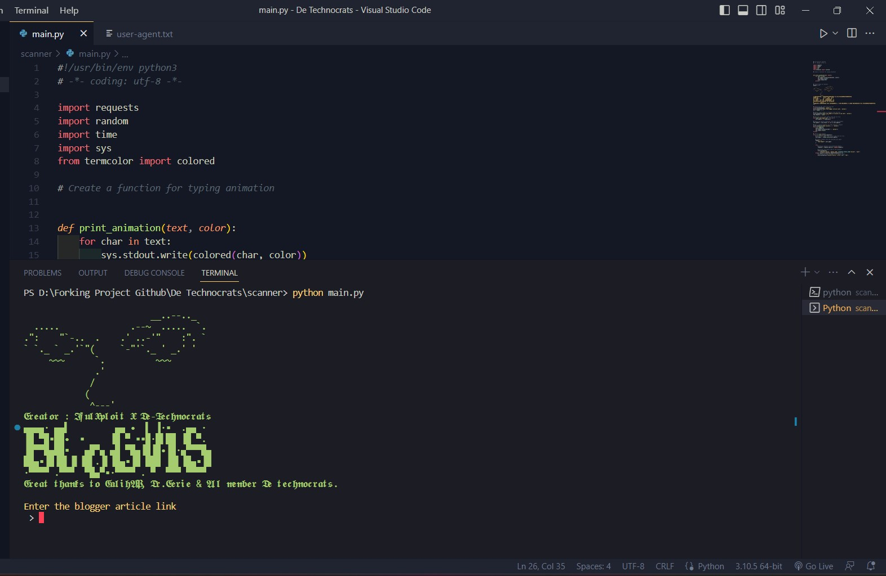

# Blogger Article Visitor Increaser

  

This is a Python script that sends requests to a Blogger article to increase the
visitor count.

## Usage

1. Run the script using the command `python blogvis.py`.
2. Enter the Blogger article link when prompted.
3. Enter the number of visitors to be sent when prompted.

## Requirements

This script uses the following Python modules :

- `requests`
- `random`
- `time`
- `sys`
- `termcolor` in fact, only with the request module and the random module you
  can make the program.😅

## Installation

1. Clone this repository using the command
   `git clone https://github.com/username/repo.git`
2. Navigate to the repository directory using the command `cd repo`.
3. Install the required Python modules using the command
   `pip install -r requirements.txt`.

Sure! Here's an example of a contribution invitation you can add to your
README.md file:

## Want to Contribute?

Thank you for considering contributing to our project! We appreciate any help or
contributions you can offer, whether it's reporting a bug, submitting a feature
request, or contributing code.

If you're interested in contributing code, please follow these steps:

1. Fork this repository
2. Create a new branch (`git checkout -b feature/your-branch-name`)
3. Make your changes and commit them (`git commit -am 'Add some feature'`)
4. Push to the branch (`git push origin feature/your-branch-name`)
5. Create a new Pull Request

Please make sure to test your changes thoroughly and provide a clear description
of the problem you're trying to solve or the feature you're adding.

Thank you for your contribution!

## Credits

The ASCII art banner used in this script was created using the
[ASCII Art Generator](https://patorjk.com/software/taag/).

## Disclaimer

This script is intended for educational purposes only. The authors and
contributors are not responsible for any misuse or damage caused by this script.

## License

This project is licensed under the MIT License - see the
[LICENSE](https://github.com/De-Technocrats/blogvis/blob/main/LICENSE) file for
details.
